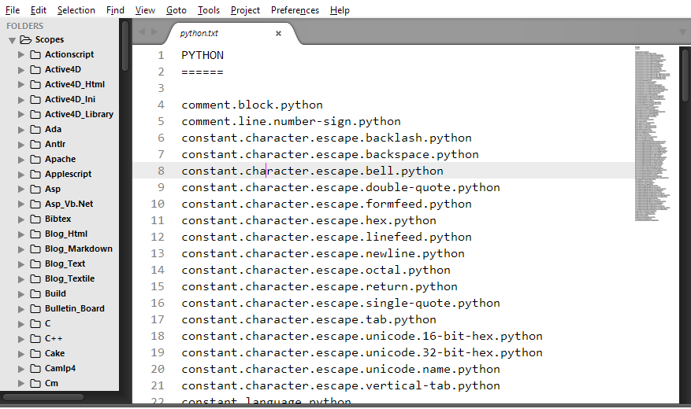

# Scopes

## Screenshot

## Programming Language Scopes
Scopes contains 161 programming languages scopes which can be used for syntax highlighting.

## Contributing
All contributions are welcome. You can fork me on github.com/tushortz/scopes

## License
MIT © 2015 Taiwo Kareem | taiwo.kareem36@gmail.com

This is free software. It is licensed under the MIT License. Feel free to use this in your own work. However, if you modify and/or redistribute it, please attribute me in some way, and it would be great if you distribute your work under this or a similar license, but it's not required.

## Acknowledgements
 
All glory belongs to God for his mercy and guidance.

